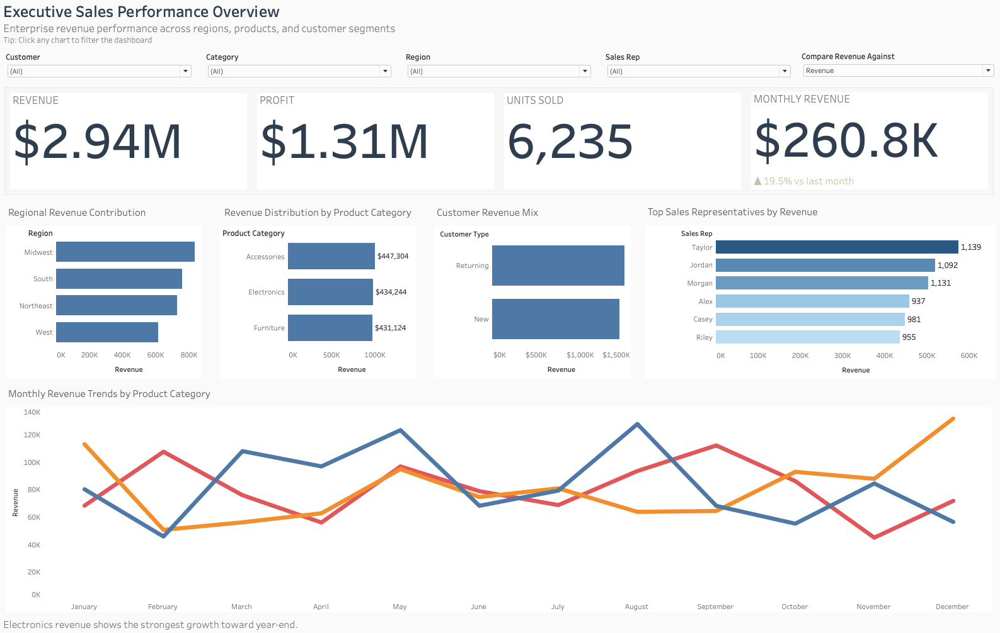
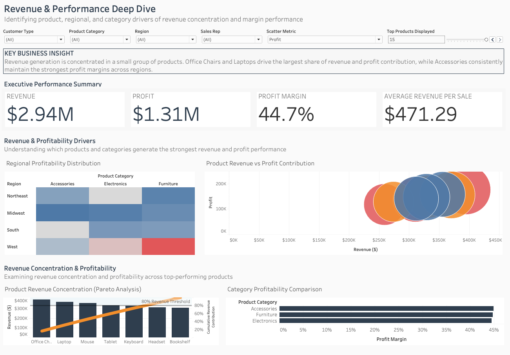

# Data Analytics Portfolio – Jovanne Saldierna

This repository contains analytics projects demonstrating skills in business intelligence, SQL analysis, data visualization, and product performance analysis.

## Tools & Technologies 

- SQL
- Tableau
- Data Visualization
- Product Analytics
- Business Intelligence
- Funnel Analysis
- Customer Retention Analysis

## Projects

### Sales Performance Analytics Dashboard

Interactive Tableau dashboards analyzing revenue drivers, profitability trends, and product performance across regions and customer segments.

Key skills:
- Tableau dashboard design
- KPI reporting
- Pareto analysis
- profitability analysis
- parameter-driven filtering

### 2. Customer Churn Analysis
SQL analysis focused on customer retention, churn risk, lifetime revenue, tenure segmentation, and inactivity-based churn logic.

Key skills:
- SQL
- CTEs
- window functions
- churn analysis
- customer segmentation

### 3. Product Funnel Analysis
SQL project analyzing user progression through a product conversion funnel to identify step-level conversion rates, drop-off points, and growth opportunities.

Key skills:
- SQL
- funnel analysis
- product analytics
- conversion rate analysis
- growth metrics
